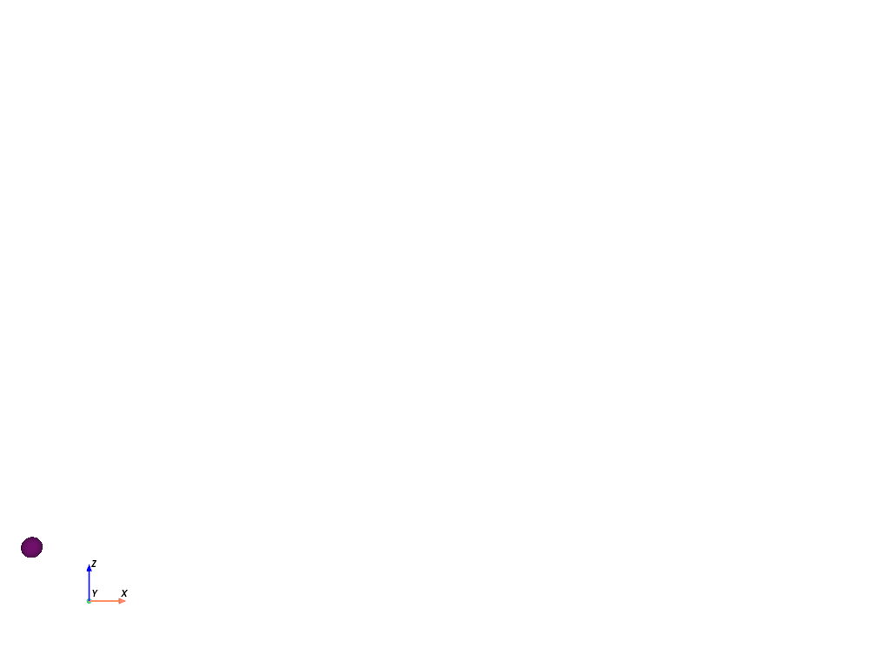

  

# ml-ballistics
Solve ballistics problems with machine learning ([documentation](https://louis-pujol.github.io/ml-ballistics/))

The game: a missile is launch at `t=0` from position `(0, 0)` with a given initial velocity, the goal is to reach another sphere (target), that flies at an altitude `z > 0` Different scenarios are possible for the missile forces (air resistance or not, wind...) or for the trajectory of the target (constant speed, acceleration, oscillations around a given altitude...). The trajectory of the target is also defined by a set of forces, it is a continuous ODE so it is determined by initial speed and position.

Given contrains for the missile and a trajectory pattern for the target, the goal is to learn to adjust the initial velocity of the sphere to reach the target. The input is he initial position and velocity of the target and the model must output an initial speed for the missile.

  <figure>
    
    <figcaption>Two missiles with same initial speed, with air resistance (red) or without (blue).</figcaption>
  </figure>

For the moments, all objects are sphere.  More about the mechanics of a bullet can be found in this [post](https://euroballistics.org/lois_balistiques_Eng.htm#balexterieure) from euroballistics.
